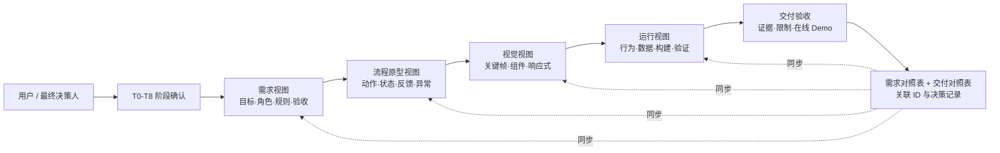

# AI 应用与创新亮点：四视图全栈同步工作流

## 1. 创新成果概述

本项目的 AI 应用不只是让 AI 生成 PRD、界面或代码，而是将一套可复用的产研协同方法封装为 Codex Skill：`run-four-view-fullstack-workflow`。

这套工作流以“四视图同步法”为核心，把一个产品事实分别落在需求、流程原型、视觉设计和可运行产品四个专业视图中，并通过阶段确认、变更分类、状态追踪和验收证据保持一致。用户始终是最终决策人，AI 负责读取上下文、发现冲突、同步受影响材料、执行实现并提供可复现的验证结果。

TraceFlow 进一步将这套方法产品化：四视图不再只是项目文档的组织方式，而是项目首页的总览入口；需求对照表不再只是交付附件，而是需求创建、下游关联和变更影响分析的共同依据。

它解决的不是“AI 能不能一次生成更多内容”，而是“AI 连续参与复杂项目时，如何避免需求、原型、UI 和代码越做越不一致”。

## 2. 为什么需要这套工作流

常见的 AI 产研过程容易出现四类问题：

1. AI 根据一句宽泛指令同时生成需求、页面和代码，未经过产品规则确认，后续返工范围不可控。
2. 视觉探索被误当成产品规则，界面看起来完整，但功能、角色权限和业务状态与需求不一致。
3. 需求发生变化后只修改当前文件，原型、视觉、运行代码和验收口径没有同步更新。
4. 交付只说明“已经完成”，缺少可访问页面、状态入口、构建结果和验收记录等可检查证据。

四视图全栈同步工作流把 AI 从单次内容生成器变成受规则约束的产研协作者：每次只推进已确认范围，并明确哪些事实由哪个视图负责、哪些材料因变更受到影响、用什么证据证明结果。

## 3. 方法来源与融合创新

这套 Skill 不是照搬某一个既有流程，而是参考并融合多类成熟工作流和 AI 能力，再针对“单人决策、AI 协同、比赛限时交付”的场景进行取舍。

| 参考的方法或能力 | 吸收的核心机制 | 在四视图工作流中的转化 |
| --- | --- | --- |
| 产品阶段门管理 | 进入下一阶段前明确输入、决策、产物和退出条件 | 建立 T0 至 T8 确认关卡，每次只推进一个已授权的小阶段 |
| 敏捷需求与验收标准 | 用可观察行为描述需求，避免只有功能名称 | 要求每个 P0 需求包含用户动作、预期结果、数据边界和验收方式 |
| 用户流程与状态建模 | 用状态、动作、反馈和异常恢复表达真实体验 | 将原型从静态页面列表升级为可追踪的状态转移与反馈规则 |
| 设计系统与组件思维 | 用令牌、组件变体和关键帧约束视觉一致性 | 将 Figma 关键帧、组件规则和响应式变换纳入视觉视图 |
| 软件工程与发布治理 | 构建、测试、可复现入口、风险控制和验收证据 | 将运行视图与直接预览、构建结果、已知限制和发布记录绑定 |
| AI Agent 任务编排 | 持续读取上下文、执行工具、生成多种专业产物 | 把 AI 行为约束为“检查 → 提议 → 确认 → 同步 → 验证 → 交付”的闭环 |
| 变更影响分析 | 根据变更性质确定影响范围，减少漏改和无效全量修改 | 建立 `V / B / D / R` 四类变更规则，只同步真正受影响的视图 |
| 可追溯矩阵 | 将需求、设计、实现和测试建立稳定关联 | 使用 `REQ-*`、`TF-*`、`AVATAR-*` 与 `delivery-map.md` 连接四个视图和运行证据 |

真正的创新点不在于增加更多文档，而在于让 AI 能够判断：当前事实属于哪个视图、一次变化影响哪些视图、何时必须暂停等待确认、什么证据才足以宣称完成。

## 4. 四视图同步模型

四个视图各自拥有不同类型的事实，不把某一个文件夸大为可以自动同步一切的“唯一真相”。

| 视图 | 负责的产品事实 | 本项目证据 |
| --- | --- | --- |
| 需求视图 | 项目目的、目标用户、范围、业务规则、数据边界和验收标准 | [PRD 需求文档](requirements.md)、[需求对照与决策记录](delivery-map.md) |
| 流程原型视图 | 用户动作、状态转移、即时反馈、异常与恢复路径 | [流程原型](prototype.md)、`TF-01` 至 `TF-07D` 状态与 `AVATAR-*` 流程依据 |
| 视觉视图 | 已确认关键帧、组件规则、视觉令牌、响应式和资源边界 | [视觉说明](visual-spec.md)、[Figma 项目总览关键帧](assets/figma-keyframes/01-project-overview.png)、[Figma 设计文件](https://www.figma.com/design/XDlIRPtgf6UZxU7gHPSso1) |
| 运行视图 | 真实交互、数据状态、实现边界、构建、部署和验收证据 | [技术就绪说明](technical-spec.md)、[验收记录](acceptance.md)、[在线 Demo](https://bunqnf.github.io/traceflow-demo/) |

## 5. T0-T8 阶段关卡

| 阶段 | AI 与用户共同完成的关键决策 | 本项目中的应用 |
| --- | --- | --- |
| T0 项目框定 | 为什么做、为谁做、范围和真实性边界 | 聚焦单个 H5 项目的需求追踪，不建设通用用户、组织和权限配置平台 |
| T1 需求 | P0 功能、角色、规则、数据边界和验收标准 | 覆盖六阶段主流程、固定角色边界、资产关联、版本和变更追溯 |
| T2 流程原型 | 页面状态、动作、反馈、异常和恢复 | 定义从空项目到 `v1.0` 交付，以及 `CR-001` 从发起到 `v1.1` 内容齐备的两条核心路径 |
| T3 视觉设计 | 关键帧、组件、视觉令牌和响应式规则 | 冻结四张 Figma 关键帧和冷灰弥散光、柔和多色协作块、渐变主操作的工作台语言 |
| T4 技术就绪 | 架构、状态归属、模拟/真实边界和验证方案 | 选择 React、TypeScript、Vite 与浏览器 `localStorage`，不引入比赛 Demo 不需要的后端 |
| T5 静态实现 | 页面结构与视觉基线是否稳定 | 完成项目入口、四视图总览、需求对照、方案资产和变更影响的桌面/窄屏界面 |
| T6 行为实现 | 动作、反馈、状态影响和异常是否符合规则 | 接通创建、AI 需求对照、原型、UI 双路线、前端、验收、四视图资产和五项角色变更任务 |
| T7 交付验收 | 四视图是否一致、Demo 是否可运行、证据是否可访问 | 建立 Markdown 交付导航、Figma PNG、GitHub 公开仓库、Pages 自动部署和验收记录 |
| T8 复盘 | 哪些方法可复用、哪些只适用于当前项目 | 只在得到用户确认后，才将有证据的经验回写到 Skill |

## 6. AI 如何参与，而不是替代决策

工作流明确规定用户是最终决策人。AI 每次修改前需要说明目标、待决定事项、输入、预期输出和退出条件；在用户确认后，AI 才执行对应范围的生成、修改、验证或发布。

AI 在项目中承担五类任务：

1. **理解与拆解：** 重读赛题和评分规则，把宽泛目标拆解为角色、规则、状态和验收结果。
2. **跨视图同步：** 当需求表格、原型依据、UI 审核路线或变更规则变化时，识别并更新受影响的需求、流程、视觉、代码和追踪记录。
3. **工具协同：** 联动 Figma、代码编辑、构建、浏览器验证、Git 和 GitHub Pages，将不同工具产物串成可交付闭环。
4. **质量验证：** 检查 Markdown 表格、链接、构建结果、响应式、交互链路、远端提交和部署状态。
5. **证据整理：** 将确认记录、关键状态、Figma 帧、可运行页面和验收结果组织为评审可直接检查的材料。

AI 不替用户决定产品方向，也不把预置数据、规则模拟、自动审核或静态设计描述成真实服务。所有模拟边界都在需求、技术和验收材料中明确说明。

## 7. 变更同步机制

Skill 将变更分成四类：

| 类型 | 含义 | 必须同步的内容 |
| --- | --- | --- |
| `V` | 视觉变化 | 视觉规范、运行页面和视觉验证证据 |
| `B` | 行为或规则变化 | 需求、流程、相关视觉状态、运行实现、验收和决策记录 |
| `D` | 数据或 API 变化 | 数据边界、技术契约、运行实现、测试及相关用户状态 |
| `R` | 发布或交付风险变化 | 发布验证、可访问性、恢复方式、交付记录和最终证据 |

这避免了两种极端：只修改当前文件导致其他视图失真，或不分影响范围地机械更新所有文件造成额外噪音。

本项目中的真实例子包括：

- 项目首页必须以四视图总览作为交付入口，属于 `B+V`，同步更新需求范围、流程入口、Figma 关键帧和运行页面。
- 需求对照表的“流程依据”必须精确到 `prototype.md` 中的 `AVATAR-*` 状态 ID，属于 `B+D`，同步更新 PRD、原型、运行数据和验收口径。
- UI 阶段增加“只审核关键帧制作高保真原型”与“审核全部 UI 直接制作实际页面”两条路线，属于 `B+D+V`，同步影响流程、状态模型、界面与交付物。
- 任意角色、任意阶段发起 `CR-001` 后，AI 从 `REQ-003` 沿流程、视觉、实现和验收关联生成五项责任任务，属于 `B+D+V`。
- GitHub Pages 和 Markdown 交付导航属于 `R`，同步更新 README、公开链接、构建工作流和交付对照表。

完整记录见 [交付对照表](delivery-map.md)。

## 8. 可追溯与证据优先

工作流为核心状态分配稳定 ID，例如 `TF-01`、`TF-02A`、`TF-03`、`TF-04`、`TF-05`、`TF-06` 和 `TF-07A` 至 `TF-07D`。演示项目的流程依据再以 `AVATAR-*` 状态 ID 精确连接每条 `REQ-*`。每个状态都可以关联到需求依据、流程依据、Figma 视觉依据、运行实现和验收结果。

证据优先级依次为：

1. 可稳定访问的运行状态；
2. 自动构建或部署结果；
3. 与状态和版本对应的 Figma 帧或运行截图；
4. 有环境、步骤和预期结果的人工验证记录；
5. 只有“已经完成”的实现声明。

只有第五类声明时，工作流不允许把状态标记为“已验证”。这一规则使 AI 输出从“看起来完成”转向“评审可以复现”。

## 9. 本项目形成的创新价值

### 9.1 产品价值

- AI 先固化用户、范围和规则，再进入视觉和代码，降低因理解偏差造成的返工。
- 需求对照表将需求、流程、视觉、前端和验收放在同一可追溯关系中，为变更影响判断提供稳定依据。
- 用户可以逐阶段控制方向，不需要理解底层技术即可完成产品决策。

### 9.2 协同与治理价值

- 业务方、产品、UI、前端和验收五类角色以固定职责参与，不为比赛 Demo 建设冗余的用户与组织管理。
- 每项变更任务都需经过“收到 → 同意 → 编辑 → 提交”，让责任人、关联资产和流转状态可见。
- 演示自动审核始终标明“演示”，不将比赛便利描述成真实生产权限。

### 9.3 设计价值

- 探索性视觉不会自动改变业务规则，已确认关键帧和功能内容分别管理。
- 四张关键帧冻结了总览、需求、AI 审核和变更协同的主要视觉模式，其他页面复用状态、审核栏和资产链路规则。
- 当页面职责或业务状态变化时，可以明确识别需要重开的视觉状态，而不是模糊地“重画一遍”。

### 9.4 工程与交付价值

- 技术方案从已确认规则和状态出发，不为比赛 Demo 引入无必要的服务端复杂度。
- Vite 构建、GitHub Actions、Pages HTTPS 地址、Figma PNG、Markdown 导航和验收记录组成可访问、可追溯的最终交付。
- 同一个浏览器中的项目状态、版本和审计记录可恢复，同时明确说明不同设备不共享本地数据的真实边界。

### 9.5 方法复用价值

- 同一 Skill 已用于场景一 TraceFlow 和场景二 GlobMeet，证明阶段门、四视图、变更分类和证据规则不依赖某个具体业务领域。
- 四个视图可以交接给产品、设计、工程和 QA，不依赖隐藏的聊天上下文。
- 阶段门、变更分类和证据规则可复用于其他 AI 全栈项目，具体业务规则仍保留在对应项目材料中。

## 10. 创新总结

`run-four-view-fullstack-workflow` 的核心贡献，是把零散的 AI 生成能力组织成一套受用户决策约束、可以持续同步、能够验证并支持交付的产研方法。

它不是要求需求、原型、视觉和代码永远同时修改，而是通过事实归属、变更影响和阶段证据，判断什么时候应该同步、同步哪些内容、何时可以进入下一阶段。

TraceFlow 将这种方法再次转化为可交互产品：需求对照表承载跨资产关联，四视图总览承载阶段交接，变更协同承载影响识别与角色责任。这使 AI 真正参与了从问题理解到高保真 Demo 交付的完整过程，而不只是产出某一个孤立文件。
