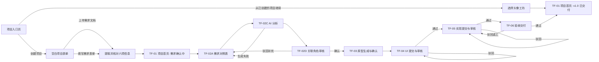
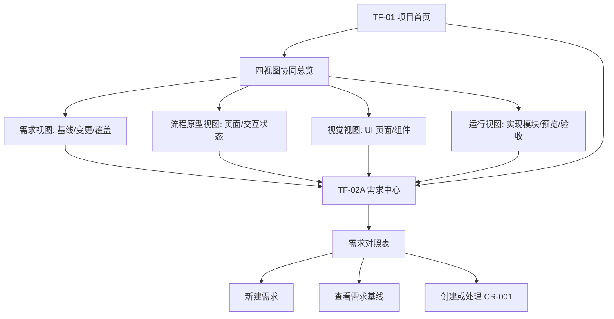

# TraceFlow 轻量流程原型

## 1. 原型范围

- **对应需求版本：** `docs/requirements.md`，`REQ-001` 至 `REQ-014`。
- **本轮验证目标：** 让评审无需口头补充即可走通一条新需求的六阶段交付路径，以及一次 `CR-001` 跨原型、UI、前端和验收资产的变更路径。
- **不验证的内容：** 品牌视觉、组件外观、真实 Figma/Git/AI 集成、生产性能与多人实时协作。
- **原型载体：** 状态表、Mermaid 流程图和后续可转译为线框的操作说明。

## 2. 核心路径

### 2.1 新需求到 `v1.0` 交付

**路径结果：** 业务方确认后的需求被锁定为 `v1.0`；每一阶段均生成与上一阶段关联的资产。验收通过后，`v1.0` 成为当前交付版本，项目首页四视图刷新为“已交付”。

**入口规则：** “从已创建的项目继续”展开原生项目选择框，当前仅提供“2027 新年头像工坊 H5”，打开后载入完整 `v1.0` 交付快照；“创建项目”不继承示例内容，六项字段均为空。

### 2.2 `CR-001` 变更到 `v1.1` 交付

**路径结果：** `CR-001` 的影响报告从 `REQ-003` 出发，沿需求对照表定位 `prototype.md: AVATAR-03`、对应视觉依据、`FE-03` 和 `AC-03`。五项责任任务必须分别完成“同意变更 -> 提交变更内容”；未受影响资产及原主流程阶段保持不变。

### 2.3 四视图总览与需求对照表的进入关系

**规则：** 项目首页是跨四视图的状态与风险总览；需求对照表是需求中心的默认入口；方案资产是按交接顺序汇集四类交付物的总库。资产单项展示来源、格式、版本、责任角色、关联对象和交付入口，且明确区分“本地附件”与“演示模拟”。三者均可下钻，但不能替代各阶段的审核动作。需求对照表在 AI 分析完成后形成 `REQ-*` 草稿，人工确认后冻结为影响分析的数据底座；原型、UI、前端与验收阶段的生成、审核结果必须同步回写各关联项状态。

## 3. 页面与状态

| 状态 ID | 用户目标 | 进入条件 | 可执行动作 | 即时反馈 | 数据/持久化变化 | 离开条件 |
| --- | --- | --- | --- | --- | --- | --- |
| `TF-01` 项目首页 | 了解项目在四视图中的整体进度和当前风险 | 进入项目或完成任一审核/交付动作 | 查看需求、流程原型、视觉、运行四视图；从当前视图进入对应阶段 | 五阶段进度条以完成态绿色整块强调当前阶段；四视图卡显示版本、完成度、阻塞项、责任人；需求、原型、UI、前端与验收阶段的主操作均位于对应视图卡内 | 无；读取当前本地项目快照 | 用户选择需求中心、视图内主操作或一个阶段 |
| `TF-02A` 需求对照表 | 查阅需求与关联资产，并决定新建或变更 | 进入需求中心；`CR-001` 任一状态变更后返回 | 新建需求、查看需求基线、发起变更、查看关联和审计记录 | 表格按需求显示原型/UI/前端/验收/版本状态；受影响项显示“待更新” | 无；读取项目快照 | 新建需求进入 `TF-02B`；变更进入 `TF-07A`；查看进入详情抽屉 |
| `TF-02B` 创建需求 | 录入可分析的业务需求 | 业务方从需求对照表选择“新建需求” | 填写标题、业务目标、受众、核心诉求；提交或取消 | 必填项即时校验；提交后显示“已提交，等待产品分析” | 新建草稿需求及审计记录 | 提交进入 `TF-02C`；取消返回 `TF-02A` |
| `TF-02C` AI 分析 | 获得可审核的结构化需求 | 产品经理打开草稿需求 | 发起分析；编辑完整 `REQ-*` 对照表的需求内容与优先级；新增需求或删除未冻结行；查看四类下游资产的只读状态；保存草稿或重新生成 | 展示短暂“正在分析”；生成后显示与需求中心一致的完整表格；新增行自动编号；删除后即时移除但至少保留一条；原型/UI/前端/验收列只显示“待创建”，不显示内部关联编号，也不提供输入框；保存后显示时间 | 保存需求对照草稿、编辑结果和重试记录；需求编号与内部关联编号保持锁定 | 提交关联角色审核进入 `TF-02D`；失败留在本状态 |
| `TF-02D` 关联角色审核 | 将需求转为不可覆盖的业务基线 | 产品经理提交已编辑的需求对照表 | Demo 中由需求方自动审核 | 屏幕正中显示“需求方已自动审核通过（演示）”浮窗，浮窗外内容轻度模糊压暗；随后进入项目总览并将当前阶段切到原型生成 | 审核通过时建立 `v1.0` 需求版本快照与关联占位项 | 自动审核通过后进入 `TF-03` |
| `TF-03` 原型生成与确认 | 将已确认需求转为可供设计和开发评审的状态模型 | `v1.0` 或 `v1.1` 需求基线已确认，且产品经理拥有待办 | 一键复制需求 Prompt；上传补充交付物；生成主要产出 `prototype.md`、产品功能架构图和 Mermaid 主流程图；查看需求对照更新；重新生成或提交关联角色审核 | 复制后显示成功反馈；上传后显示文件名；生成中显示来源和进度；`prototype.md` 包含核心路径及带唯一状态 ID 的页面与状态表；生成后每条需求的流程依据由“待创建”更新为 `prototype.md` 中一个或多个状态 ID 并进入“待审核”；提交后居中连续提示“需求方已自动审核通过（演示）”“开发已自动通过需求评审（演示）” | 保存上传文件名、`prototype.md`、补充原型资产、`REQ-* -> STATE-ID` 关系、版本和两条演示审核记录 | 两项演示审核均通过后进入 `TF-04`；重新生成留在本状态 |
| `TF-04` UI 生成与双路线审核 | 将原型落实为关键帧、规范与设计交付 | 原型已确认，UI 设计师收到待办 | 一键复制需求为关键帧 Prompt；上传或生成 `D-01` 至 `D-03`；重新生成；选择“通过关键帧审核”或“通过全部 UI 审核” | Prompt 成功复制后即时反馈；UI 草案生成后显示两张路线卡：路线 A 明确只冻结 `D-01` 并进入高保真原型制作，路线 B 明确冻结 `D-01` 至 `D-03` 并进入实际 H5 页面制作 | 保存 `D-xx` UI 资产、视觉依据、版本、`implementationRoute` 和审核记录 | 路线 A 以 `hifi-prototype` 进入 `TF-05`；路线 B 以 `actual-page` 进入 `TF-05`；重新生成留在本状态 |
| `TF-05` 实现提交与审核 | 按 UI 审核范围制作高保真原型或实际 H5 页面 | UI 已选择审核路线，前端工程师收到对应待办 | 路线 A 制作高保真页面、核心交互与预览地址；路线 B 制作响应式页面、业务交互与实际体验地址；提交审核 | 项目总览、顶部标题、来源资产、交付物文案和审核按钮均显示当前路线；通过后显示验收用例已生成；驳回显示原因 | 保存 `FE-xx` 实现、预览、来源 UI、路线、版本和审核记录 | 通过进入 `TF-06`；驳回由前端工程师在本状态更新 |
| `TF-06` 验收交付 | 判断版本是否可交付 | 全部关联实现审核通过 | 执行用例、标记通过/失败、填写驳回原因、确认交付 | 覆盖检查实时显示缺口；通过显示发布包号；失败定位责任对象 | 保存 `AC-xx` 用例结果、交付版本和审计记录 | 通过回到 `TF-01`；失败回到 `TF-05` |
| `TF-07A` 创建与编辑变更 | 在不打断主交付阶段的前提下记录需求调整 | 任一固定角色从任意阶段的项目总览发起，或从变更协同空状态进入 | 选择发起角色、填写标题与变更描述、载入示例、取消 | 页面显示 `CR-001` 草稿、发起阶段和版本影响；字段缺失就近提示 | 本地保存变更草稿；创建动作写入审计 | AI 分析进入 `TF-07B`；修改已分析输入会回到本状态并清除旧影响 |
| `TF-07B` AI 影响分析 | 从需求对照表明确变更类型、受影响视图、资产与责任人 | `CR-001` 标题和描述完整 | 发起分析、修改后重做、查看追踪路径 | 显示变更类型、命中 `REQ-*`、四视图、五项角色任务及“已有资产更新/未来资产纳入”说明 | 保存 AI 摘要和任务草案；尚未通知责任人 | 确认范围进入 `TF-07C`；修改输入返回 `TF-07A` |
| `TF-07C` 提交申请与角色同意 | 正式发出申请并让每位责任人明确接收任务 | AI 影响分析已完成 | 提交变更申请；各任务分别执行“同意变更” | 提交后任务为“待同意”；同意后只开放该任务的内容编辑器，并更新同意计数 | 保存申请时间、每次同意动作、责任角色和任务状态 | 任一任务同意后进入 `TF-07D`；未同意任务继续留在本状态 |
| `TF-07D` 编辑与提交变更内容 | 汇总各视图负责人完成的同步更新 | 责任人已同意自己负责的任务 | 填写变更内容、载入演示交付、上传附件、提交 | 空内容阻止提交；成功后显示提交说明与附件名；五项齐备时显示完成横幅 | 保存需求、原型、视觉、实现和验收的提交内容及完整审计，不覆盖原主阶段 | 未齐备继续处理其余任务；全部齐备形成 `v1.1` 内容齐备记录 |

## 4. 操作反馈

| 操作 ID | 所在状态 | 用户操作 | 即时反馈 | 成功结果 | 失败/取消结果 | 需求依据 |
| --- | --- | --- | --- | --- | --- | --- |
| `ACT-01` | `TF-02B` | 提交新需求 | 字段校验、提交中状态 | 创建草稿并通知产品经理待分析 | 保留输入；取消不创建记录 | `REQ-001` |
| `ACT-02` | `TF-02C` | 发起或重试 AI 分析 | 可感知加载、步骤提示 | 生成可编辑建议和待确认项 | 保留原始/已编辑内容并提供重试或丢弃 | `REQ-002` |
| `ACT-03` | `TF-02D` | 确认或驳回需求 | 确认/驳回结果提示 | 建立 `v1.0` 基线并解锁原型，或退回补充 | 未填写驳回说明时阻止提交 | `REQ-003` |
| `ACT-04` | `TF-03` | 确认原型 | 来源需求与原型清单确认提示 | 保存原型并生成 UI 待办 | 退回编辑不解锁 UI 阶段 | `REQ-004` |
| `ACT-05` | `TF-04` | 提交、通过或驳回 UI | 状态标签和责任人待办更新 | 通过后生成前端待办 | 驳回保存原因并回到 UI 待办 | `REQ-005` |
| `ACT-06` | `TF-05` | 提交、通过或驳回实现 | 审核状态和预览引用更新 | 通过后生成验收用例 | 驳回保存原因并回到开发待办 | `REQ-006` |
| `ACT-07` | `TF-06` | 执行验收并交付/驳回 | 覆盖检查、用例结果和发布校验 | 生成交付版本并更新项目首页 | 不通过时定位模块并回到前端阶段 | `REQ-007` |
| `ACT-08` | `TF-07A` 至 `TF-07C` | 创建、编辑、分析并提交 `CR-001` | AI 按四视图展示受影响数量、来源链路、理由和五项责任任务 | 申请发出后任务统一进入“待同意”，原主阶段与基线不变 | 修改输入会作废旧分析；空字段阻止分析 | `REQ-008`、`REQ-009` |
| `ACT-09` | `TF-07C` 至 `TF-07D` | 责任人同意并提交负责的变更内容 | 同意后开放内容编辑器；提交后显示说明、附件与累计进度 | 五项齐备后形成 `v1.1` 内容齐备记录，保留完整审计 | 未同意不可提交；空内容不可提交 | `REQ-010` |
| `ACT-10` | `TF-01`、`TF-02A` | 切换固定角色或从总览下钻 | 可操作动作更新；无权限动作转只读说明 | 按角色呈现相应待办与进入入口 | 不允许绕过角色限制执行动作 | `REQ-011`、`REQ-013`、`REQ-014` |
| `ACT-11` | 任意持久化状态 | 刷新页面或重置演示 | 刷新恢复提示；重置前二次确认 | 刷新恢复当前快照；重置返回预置 `v1.0` | 取消重置不影响数据 | `REQ-012` |

## 5. 关键异常与边界状态

| 类型 | 是否需要 | 状态 ID | 用户如何恢复/继续 |
| --- | --- | --- | --- |
| 加载 | 是 | `TF-02C-L`、`TF-03-L`、`TF-07B-L` | 显示来源和生成步骤；完成后自动进入结果，失败后保留输入并显示重试。 |
| 空数据 | 是 | `TF-02A-E` | 初始无需求时展示空需求对照表和“新建需求”入口；演示默认仍提供 `v1.0` 数据。 |
| AI 错误 | 是 | `TF-02C-E`、`TF-07B-E` | 原始需求、变更和已编辑结果均保留；用户可重试、人工编辑或丢弃 AI 建议。 |
| 表单校验失败 | 是 | `TF-02B-V`、`TF-07A-V` | 在缺失字段旁说明必填原因，焦点移至第一个错误字段。 |
| 审核驳回 | 是 | `TF-02D-R`、`TF-04-R`、`TF-05-R`、`TF-06-R` | 必填驳回原因；系统把任务退回负责角色并保留原版本与审计。 |
| 权限/资格不足 | 是 | `TF-ROLE-RO` | 隐藏或禁用越权主动作，说明当前责任角色和下一步负责人；可切换固定 Demo 角色查看。 |
| 版本冲突 | 是 | `TF-07C-C` | 当存在未完成变更时阻止再确认新的更新计划，提示先完成、驳回或回退当前变更。 |
| 不可交付 | 是 | `TF-06-B` | 缺少实现审核或必验用例未通过时禁用交付，列出未通过项并下钻至 `TF-05`。 |
| 回退取消 | 是 | `TF-07D-X` | 取消二次确认后保持当前版本与差异视图，不写入审计。 |

## 6. 需求覆盖矩阵

| 需求规则 | 覆盖状态或转场 |
| --- | --- |
| `REQ-001` | `TF-02A -> TF-02B -> TF-02C`，`ACT-01` |
| `REQ-002` | `TF-02C`，`ACT-02`，`TF-02C-L/E` |
| `REQ-003` | `TF-02D -> TF-03` 或 `TF-02B`，`ACT-03` |
| `REQ-004` | `TF-03 -> TF-04`，`ACT-04` |
| `REQ-005` | `TF-04 -> TF-05`，`ACT-05` |
| `REQ-006` | `TF-05 -> TF-06`，`ACT-06` |
| `REQ-007` | `TF-06 -> TF-01` 或 `TF-05`，`ACT-07` |
| `REQ-008` | `TF-02A -> TF-07A -> TF-07B`，`ACT-08` |
| `REQ-009` | `TF-07C -> TF-03` 或 `TF-02A`，`ACT-08`，`TF-07C-C` |
| `REQ-010` | `TF-06 -> TF-07D -> TF-02A`，`ACT-09` |
| `REQ-011` | `TF-ROLE-RO`，`ACT-10` |
| `REQ-012` | 任意持久化状态，`ACT-11` |
| `REQ-013` | `TF-01`，`ACT-10` |
| `REQ-014` | `TF-02A`，`ACT-10` |

## 7. 流程确认记录

- **已确认的规则：** 六阶段必须顺序解锁；AI 仅提供可编辑建议；审核驳回不覆盖已确认基线；变更只标记实际受影响资产；回退不删除版本历史；项目首页展示四视图总览，需求中心以需求对照表为默认入口。
- **明确排除的路径：** 真实登录、角色配置、多项目资源排期、外部通知、实时协作、真实 Figma/Git/部署和跨项目筛选。
- **待视觉解决的问题：** 四视图总览的密度与风险层级；需求对照表在桌面和移动端的列收纳；资产关联与版本差异的阅读方式；AI 分析/影响报告的可见、可控提示。
- **待技术验证的问题：** 基于本地存储的版本快照、状态恢复和演示重置；预置 AI 失败分支的可复现入口；大屏表格向移动端详情抽屉的转换。
